# DeepResearch 项目框架图

> 生成时间：2026-05-14  
> 范围：根目录、`app/` 后端与多 Agent 工作流、`front/agent_front/` Vue 前端、配置、RAG、记忆系统。  
> 已跳过：`node_modules/`、`dist/`、`__pycache__/`、IDE 配置、二进制缓存与本地数据库内容。

## 1. 项目定位

这是一个 DeepResearch 多智能体研究助手项目，核心目标是：

- 对简单问题走快速直答链路。
- 对复杂问题走多 Agent 深度研究链路。
- 同时接入网络搜索、本地知识库、证据审计、分析写作和跨会话记忆。
- 通过 FastAPI 提供 HTTP / SSE 流式接口，通过 Vue 3 + Vite 提供聊天式前端。

## 2. 顶层目录框架

```text
deep_research/
├─ main.py                         # CLI 启动入口，转入 app/mult_agents/main.py
├─ app/
│  ├─ app_main.py                  # FastAPI 后端入口
│  ├─ backend/                     # HTTP API、配置、服务层、请求响应模型
│  │  ├─ config/settings.py
│  │  ├─ router/health_router.py
│  │  ├─ router/research_router.py
│  │  ├─ schemas/health.py
│  │  ├─ schemas/research.py
│  │  └─ service/workflow_service.py
│  ├─ mult_agents/                 # 多 Agent 核心
│  │  ├─ main.py                   # Agent 构建、CLI、checkpointer、memory 初始化
│  │  ├─ graph.py                  # LangGraph 拓扑编排
│  │  ├─ nodes.py                  # 每个工作流节点的业务逻辑
│  │  ├─ state.py                  # ResearchState 状态结构
│  │  ├─ prompts.py                # Agent system prompts
│  │  ├─ tools.py                  # Web 搜索、RAG 查询、通用工具
│  │  ├─ rag/                      # Milvus + DashScope Embedding 知识库
│  │  └─ memory/                   # 短期/长期/语义/情景记忆
│  ├─ data/memory.db               # SQLite 记忆数据文件
│  └─ test/bocha_api_test.py       # Bocha API 调试脚本
├─ front/
│  └─ agent_front/                 # Vue 3 + Vite 前端
│     ├─ src/App.vue               # 单页聊天工作台
│     ├─ src/main.ts               # Vue 挂载入口
│     └─ vite.config.ts            # dev server 与 API 代理
├─ config.json                     # 主运行配置，可被环境变量覆盖
├─ .env.example                    # 环境变量样例
├─ pyproject.toml                  # Python 项目元信息
├─ requirements.txt                # Python 依赖锁定
└─ test.md                         # RAG 入库样例文档
```

## 3. 总体架构图

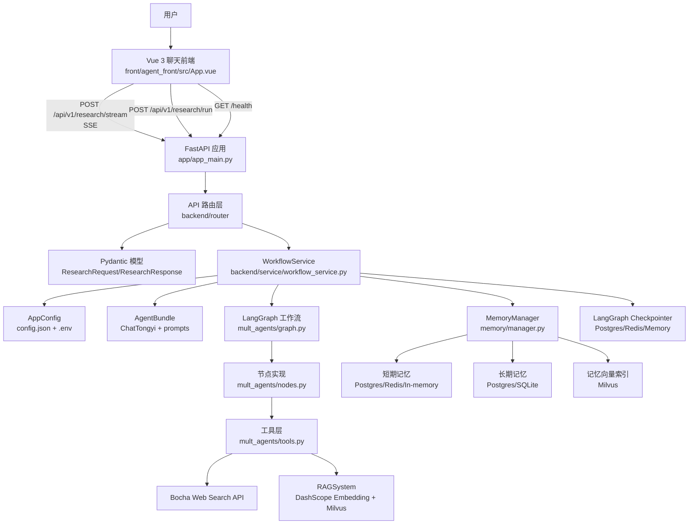

## 4. 两种运行入口

```mermaid
flowchart LR
    RootMain[main.py] --> Bootstrap[加载项目 app 路径与 .env]
    Bootstrap --> CLI[app/mult_agents/main.py]
    CLI --> CLIArgs[parse_cli_args]
    CLIArgs --> RuntimeConfig[build_runtime_config]
    RuntimeConfig --> BuildMemory[build_memory_manager]
    RuntimeConfig --> BuildAgents[build_agents]
    RuntimeConfig --> BuildCheckpoint[build_checkpointer]
    BuildAgents --> GraphCLI[build_workflow_app]
    BuildCheckpoint --> GraphCLI
    BuildMemory --> RunQuery[run_query]
    GraphCLI --> RunQuery

    AppMain[app/app_main.py] --> CreateApp[create_app]
    CreateApp --> CORS[CORS middleware]
    CreateApp --> HealthRouter[/health]
    CreateApp --> ResearchRouter[/api/v1/research]
    ResearchRouter --> WorkflowService[WorkflowService]
    WorkflowService --> GraphHTTP[同一套 LangGraph 工作流]
```

### CLI 入口

- `python main.py`：进入交互式命令行。
- `python main.py --once-query "..."`：单次执行。
- 支持覆盖 `tenant_id`、`user_id`、`thread_id`、记忆后端、checkpointer 后端、Milvus 开关等。

### HTTP 入口

- `python app/app_main.py` 或 `uvicorn app.app_main:app --host 0.0.0.0 --port 8000`
- `GET /health`：健康检查。
- `POST /api/v1/research/run`：非流式返回最终报告。
- `POST /api/v1/research/stream`：SSE 流式返回阶段事件和最终报告。

## 5. HTTP API 调用链

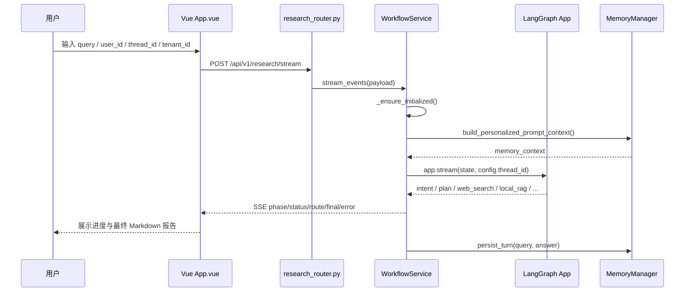

## 6. LangGraph 多 Agent 工作流

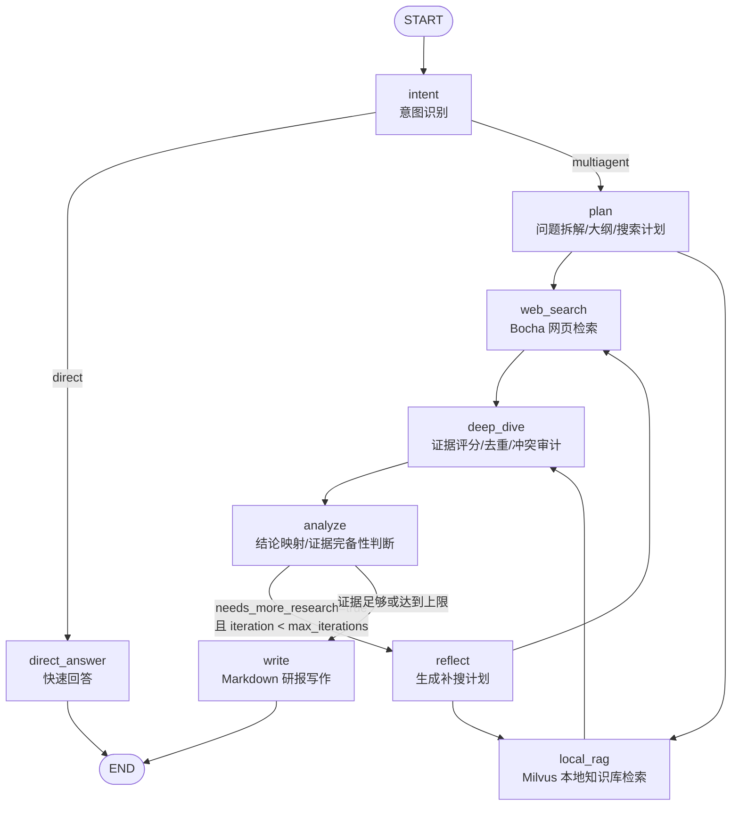

### 节点职责表

| 节点 | Agent | 输入 | 输出到 `ResearchState` | 关键逻辑 |
| --- | --- | --- | --- | --- |
| `intent` | `intent_router` | `query` | `intent`, `draft` | 规则引擎先判定，再让 LLM 输出 `direct/multiagent` JSON |
| `direct_answer` | `direct_responder` | `query`, `memory_context` | `final`, `draft` | 简单问题直接回答并结束 |
| `plan` | `planner` | `query`, `memory_context` | `plan`, `outline`, `sub_questions`, `research_questions`, `search_plan`, `budget` | 拆解任务，生成最多 6 条混合检索计划 |
| `web_search` | `scout_web` | `search_plan` 或 `supplementary_queries` | `web_search`, `web_evidence`, `web_retrieval_stats`, `web_search_trace` | 调 Bocha，每轮每条 query 最多取 4 条，分配 `WEB{轮次}_{query序号}-{结果序号}` |
| `local_rag` | `scout_local` | `search_plan` 或 `supplementary_queries` | `local_rag`, `local_evidence`, `local_retrieval_stats`, `local_rag_trace` | 查 Milvus 知识库，分配 `LOC{轮次}_{query序号}-{结果序号}` |
| `deep_dive` | `evidence_judge` | `web_evidence`, `local_evidence` | `evidence_pool`, `audit_flags`, `source_index`, `audit` | 对证据做可信度评分、去重、冲突/缺证标记 |
| `analyze` | `analyst` | `evidence_pool`, `audit_flags` | `analysis`, `findings`, `claim_map`, `needs_more_research`, `missing_gaps` | 形成结论并决定是否补搜 |
| `reflect` | `planner` | `missing_gaps`, 历史搜索计划 | `iteration`, `supplementary_queries` | 针对缺口生成补搜 query |
| `write` | `writer` | `findings`, `source_index`, `audit_flags` | `draft`, `final` | 写最终 Markdown，校验非法引用并自动追加参考资料 |

## 7. `ResearchState` 数据流

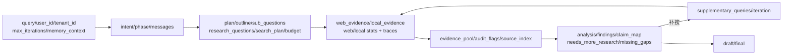

核心字段分组：

- 基础上下文：`query`、`user_id`、`tenant_id`、`memory_context`、`messages`
- 路由与计划：`intent`、`phase`、`plan`、`outline`、`sub_questions`、`research_questions`、`search_plan`、`budget`
- 检索结果：`web_search`、`local_rag`、`web_evidence`、`local_evidence`
- 证据审计：`evidence_pool`、`audit`、`audit_flags`、`source_index`
- 分析写作：`analysis`、`findings`、`claim_map`、`draft`、`final`
- 迭代补搜：`needs_more_research`、`missing_gaps`、`supplementary_queries`、`iteration`、`max_iterations`
- 可观测性：`web_retrieval_stats`、`local_retrieval_stats`、`web_search_trace`、`local_rag_trace`

## 8. Agent 与 Prompt 结构

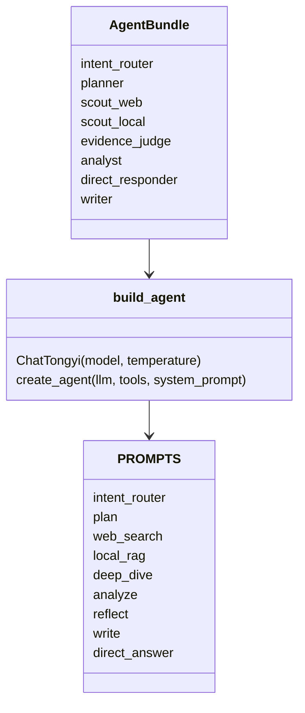

当前 `build_agents()` 会初始化 RAG 系统，但多数主流程 Agent 的 `tools` 列表为空。实际网页检索和本地 RAG 由 `nodes.py` 在节点内部直接调用：

- `bocha_web_search_records()`
- `search_knowledge_base_records()`

## 9. 检索与证据处理流程

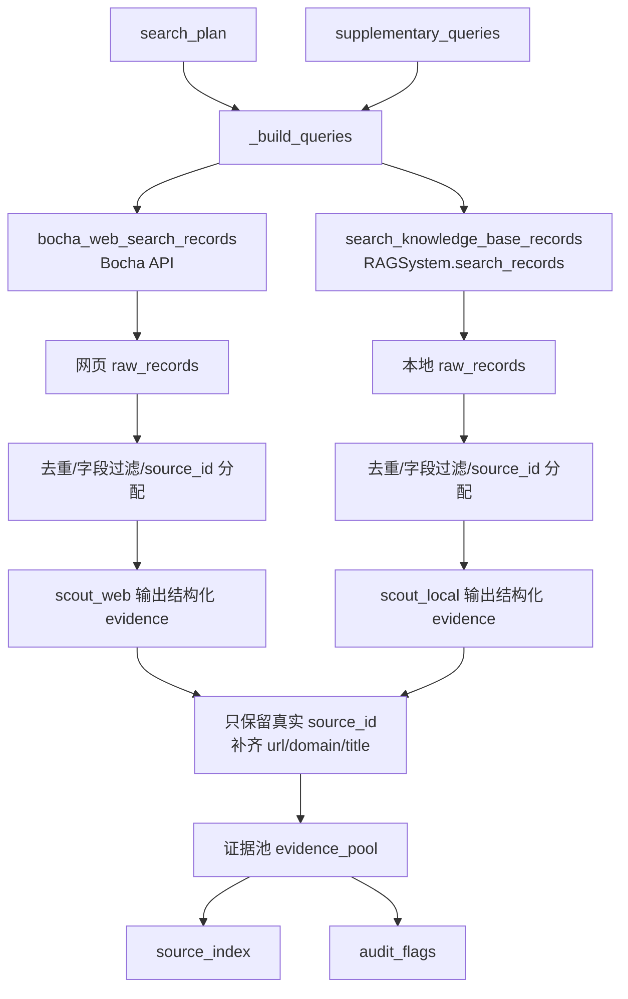

关键保护：

- LLM 输出的 evidence 必须来自真实 `raw_records` 的 `source_id`。
- Web evidence 会从原始记录补齐 `url/domain/title`。
- `write` 阶段会移除非法引用 ID。
- 参考资料列表由系统统一追加，避免 Writer 编造来源清单。

## 10. RAG 知识库框架

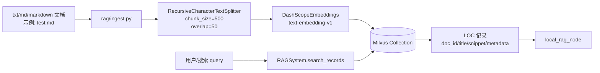

RAG 核心文件：

- `app/mult_agents/rag/core.py`：定义 `RAGConfig`、`RAGSystem`、Milvus 连接、文档切分、入库和相似度检索。
- `app/mult_agents/rag/ingest.py`：读取 `INPUT_PATH` 指向的 md/txt 文件，分块并写入 Milvus。
- `app/mult_agents/tools.py`：持有全局 `_RAG_SYSTEM`，提供 `init_rag_system()` 和 `search_knowledge_base_records()`。

## 11. 记忆系统框架

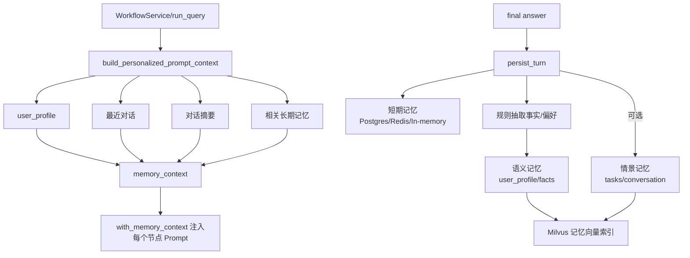

### 记忆后端

| 类型 | 默认/可选后端 | 代码位置 | 用途 |
| --- | --- | --- | --- |
| 短期记忆 | PostgreSQL / Redis / 内存 | `memory/short_term.py`, `memory/manager.py` | 存储当前线程最近对话与摘要 |
| 长期语义记忆 | PostgreSQL / SQLite | `memory/long_term.py`, `memory/manager.py` | 用户画像、偏好、事实 |
| 长期情景记忆 | PostgreSQL / SQLite | `memory/long_term.py`, `memory/manager.py` | 历史任务与结果 |
| 记忆向量索引 | Milvus | `memory/manager.py` | 用 Embedding 做相似记忆召回 |
| LangGraph 状态检查点 | PostgreSQL / Redis / InMemory | `mult_agents/main.py` | 保存 LangGraph 线程状态 |

### 记忆写入策略

- 每轮问答都会写短期记忆。
- 只有用户 query 命中“记住/我叫/我喜欢/remember/i prefer”等触发词时，才抽取长期事实或偏好。
- `SAVE_CONVERSATION_TASK=true` 时，会把对话作为情景任务保存。
- `LONG_TERM_SCOPE=user` 时，偏好合并进用户画像；`thread` 时，偏好以 thread 维度事实保存。

## 12. 前端框架

```mermaid
flowchart TB
    MainTS[src/main.ts] --> AppVue[src/App.vue]
    AppVue --> State[Vue refs<br/>userId/threadId/tenantId/query/loading/messages/progressLogs]
    State --> UI[聊天工作台 UI<br/>sidebar + message-list + composer]
    UI --> RunResearch[runResearch()]
    RunResearch --> Fetch[fetch('/api/v1/research/stream')]
    Fetch --> SSE[读取 ReadableStream<br/>解析 data: JSON]
    SSE --> Status[status/phase/route<br/>更新 progressLogs]
    SSE --> Final[final<br/>插入 assistant message]
    SSE --> Error[error<br/>展示错误消息]
    Final --> Markdown[markdownToHtml<br/>轻量 Markdown 渲染]
```

### 前端关键点

- Vite dev server：`0.0.0.0:5173`
- 代理：
  - `/api` -> `http://127.0.0.1:8000`
  - `/health` -> `http://127.0.0.1:8000`
- 主要页面：`src/App.vue`
- 当前 `src/components/*` 多数为 Vue 模板遗留组件，`App.vue` 没有引用它们。
- Markdown 渲染为自实现轻量版，支持标题、列表、代码块、粗体、斜体、行内代码和 HTTP 链接。

## 13. 配置加载与覆盖关系

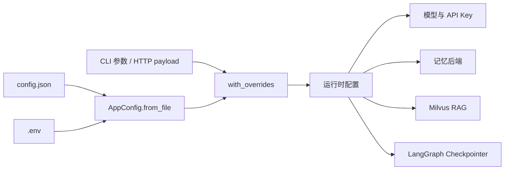

配置优先级：

1. 环境变量优先，如 `DASHSCOPE_API_KEY`、`MODEL`、`POSTGRES_DSN`。
2. 其次读取 `config.json`。
3. CLI 参数或 HTTP payload 可覆盖 `tenant_id`、`user_id`、`thread_id`、`max_iterations`、`enable_memory` 等运行时字段。

敏感配置不要写入文档或提交到代码库：

- `DASHSCOPE_API_KEY`
- `BOCHA_API_KEY`
- `POSTGRES_DSN`
- `REDIS_URL`
- 其他服务账号、数据库口令、私有 Host 信息

## 14. 外部依赖关系

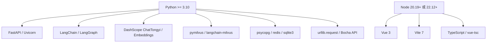

主要外部服务：

- 通义千问 DashScope：LLM 与 Embedding。
- Bocha Web Search：网络检索。
- Milvus：RAG 知识库与可选记忆向量索引。
- PostgreSQL：短期/长期记忆与 LangGraph checkpointer。
- Redis：可选短期记忆与 LangGraph checkpointer。

## 15. 启动顺序建议

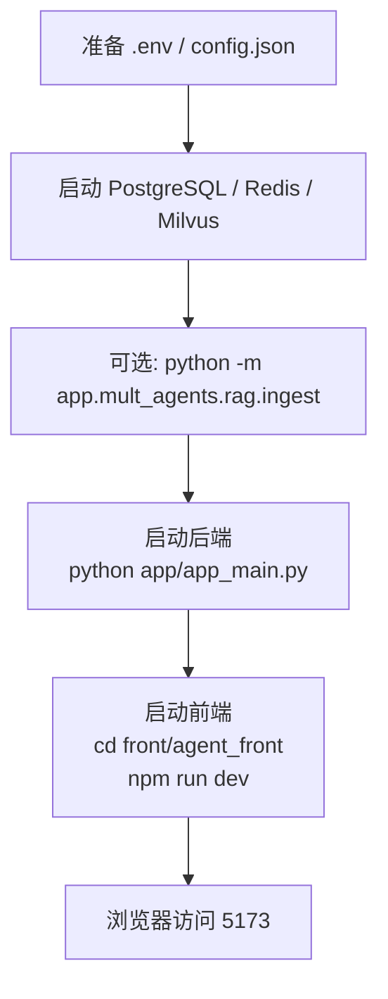

若只跑 CLI，可以跳过前端与 FastAPI：

```text
python main.py --once-query "你的问题"
```

## 16. 端到端数据流

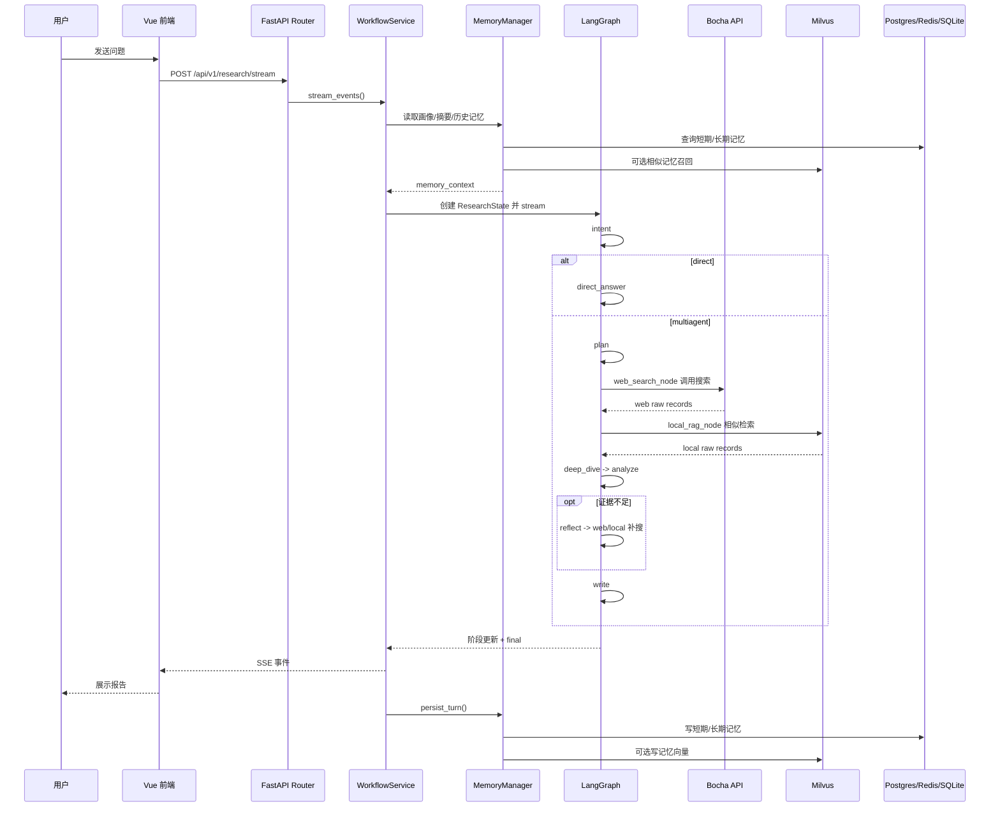

## 17. 可维护性观察

- `app/mult_agents/main.py` 中存在一组旧版节点函数，但 `graph.py` 实际导入的是 `nodes.py` 中的新节点实现；后续维护建议以 `nodes.py` 为准。
- `nodes.py` 里 `_fallback_analysis` 定义了两次，后面的简化版本会覆盖前面的增强版本；如果希望保留更丰富 fallback，需要合并这两个实现。
- `front/agent_front/src/components/*` 仍保留 Vite/Vue 模板组件，但当前页面没有使用，可以后续清理。
- `.env.example`、测试脚本等文件应避免放真实密钥；架构文档中只列变量名，不记录任何密钥值。

